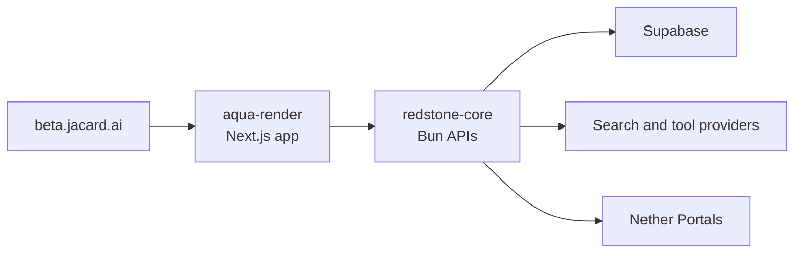
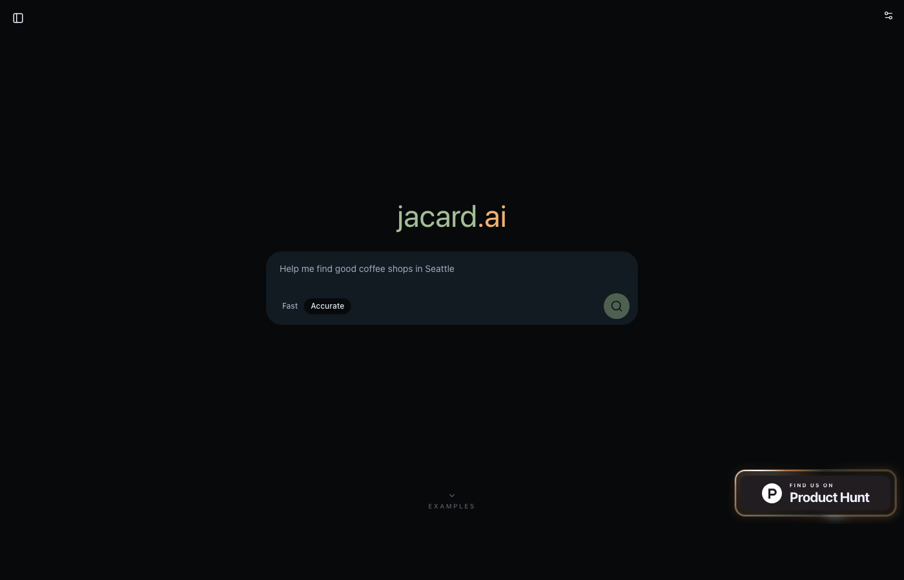
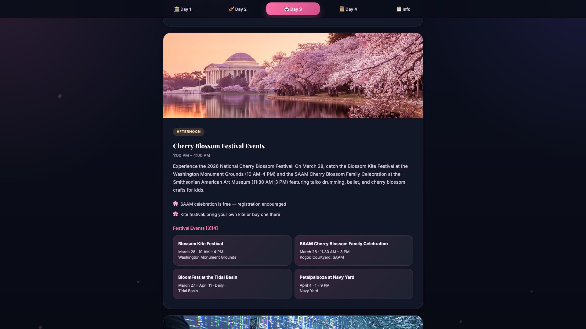

# Jacard AI Beta

Public issue tracker and feedback hub for [beta.jacard.ai](https://beta.jacard.ai).

| Beta | Report | Issues | Labels | Known issues |
| --- | --- | --- | --- | --- |
| [Open beta.jacard.ai](https://beta.jacard.ai) | [Open issue form](https://github.com/Jacard-AI/Jacard-AI-Beta/issues/new/choose) | [Browse issues](https://github.com/Jacard-AI/Jacard-AI-Beta/issues) | [View labels](https://github.com/Jacard-AI/Jacard-AI-Beta/labels) | [Known Issues and Beta Notes](https://github.com/Jacard-AI/Jacard-AI-Beta/issues/1) |

Jacard turns prompts into interactive answer pages. You still get the text answer, but alongside it Jacard generates a page shaped for the task itself.

This repo is where beta users can report bugs, regressions, confusing UX, and feature requests with enough detail for the team to triage quickly.

## What Jacard Is

- A science question can become something you can interact with.
- A comparison can become something you can scan at a glance.
- A trip plan can become something you can browse visually.

## How The Beta Works

Jacard currently spans two main systems:

- `aqua-render`: the public Next.js product surface for landing, examples, chat/search, Jacard View previews, sharing, auth, and mobile UI.
- `redstone-core`: the Bun backend for streaming chat, tool execution, persistence, artifact generation, public shares, and Jacard Pages workflows.

## Product Areas

Use the issue forms and labels to point reports at the right surface:

- `landing/examples`: homepage, examples mosaic, example detail pages
- `chat`: prompts, responses, search flow, composer, sidebars
- `research process`: tool traces, citations, process inspector, source handling
- `Jacard Views`: generated interactive answer pages, previews, view switching, artifact sharing
- `Jacard Pages`: generated pages, suggestions, gallery, edit/share/delete flows
- `sharing/auth`: signed-in state, guest mode, shared links, login/signup
- `mobile`: viewport, keyboard, layout, touch behavior

## Example Surfaces

- [Coffee Compare](https://beta.jacard.ai/examples/coffee)
- [DC Family Trip](https://beta.jacard.ai/examples/dc-trip)
- [Garden Palette Explorer](https://beta.jacard.ai/examples/garden-palette)
- [Gravity Lab](https://beta.jacard.ai/examples/gravity)
- [Pac-Man BFS Visualizer](https://beta.jacard.ai/examples/pacman)
- [Weeknight Pasta](https://beta.jacard.ai/examples/pasta)
- [Lens Lab](https://beta.jacard.ai/examples/lens-lab)

## What Belongs Here

- Bugs and broken flows on `beta.jacard.ai`
- Regressions between earlier and current beta behavior
- UX confusion where the product worked but was hard to understand or use
- Feature requests grounded in a real task or workflow
- Feedback on what feels useful, magical, or gimmicky in the current beta

Please do not use public issues for security vulnerabilities. Use the private reporting path in [SECURITY.md](SECURITY.md).

## Visual References

### Live Beta Homepage

### Example: DC Family Trip

## Filing High-Signal Issues

When you open an issue, include:

- the exact page URL
- the prompt or task you tried
- what you expected
- what actually happened
- repro steps
- browser/device details
- screenshots or shared links when possible

More guidance lives in [CONTRIBUTING.md](CONTRIBUTING.md).
